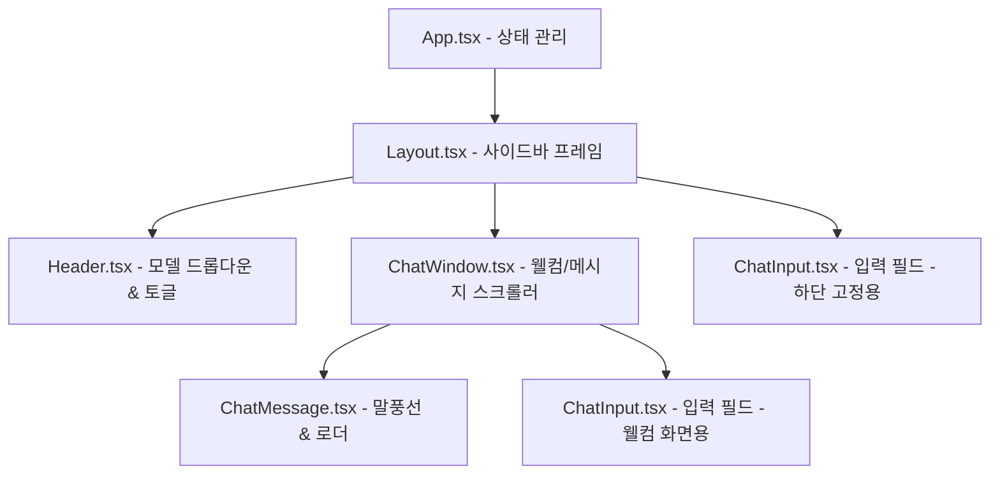

# KimsWeb AI 채팅 컴포넌트 리팩토링 계획서

이 계획서는 단일 파일([App.tsx](file:///home/kdy987/work/KimsWeb/frontend/src/App.tsx))에 집중되어 있던 AI 채팅 관련 코드와 레이아웃을 역할별로 분리하고, 사전에 구축해 둔 컴포넌트 파일들로 모듈화하여 코드의 가독성, 재사용성, 유지보수성을 극대화하기 위한 구현 계획서입니다.

---

## 🎯 목표 (Goal)
- **컴포넌트 단일 책임 분리**:
  - `App.tsx`는 전역 비즈니스 상태(대화 이력, 선택 모델, 사이드바 토글 등)만 관리하고 하위 컴포넌트를 조립하는 조율자(Orchestrator) 역할을 하도록 경량화합니다.
  - 헤더, 사이드바/전체 레이아웃, 채팅창, 입력창, 메시지 뷰를 개별 컴포넌트 파일로 분리합니다.
- **주석 규칙 및 타입 안전성 준수**: 분리된 모든 파일 상단에 표준 JSDoc 파일 개요 주석을 작성하고 TypeScript Interface를 통해 부모-자식 간 Props 데이터를 안전하게 전달합니다.

---

## 🛠️ 제안된 변경 사항 (Proposed Changes)

### 1. 개별 컴포넌트 분리 및 모듈화

#### [Layout.tsx](file:///home/kdy987/work/KimsWeb/frontend/src/components/common/Layout.tsx) [NEW IMPLEMENTATION]
* 사이드바(New Chat 버튼, 최근 대화 목록, 설정 및 개발자 프로필)와 본문 영역의 글로벌 2-컬럼 프레임을 그리는 역할을 전담합니다.

#### [Header.tsx](file:///home/kdy987/work/KimsWeb/frontend/src/components/common/Header.tsx) [NEW IMPLEMENTATION]
* 상단 네비게이션 영역을 전담합니다. 사이드바 토글 버튼, AI 모델 선택 드롭다운, 백엔드 상태 배지를 그립니다.

#### [ChatInput.tsx](file:///home/kdy987/work/KimsWeb/frontend/src/components/chat/ChatInput.tsx) [NEW IMPLEMENTATION]
* 텍스트 입력 폼과 전송 버튼, 하단 면책 조항을 그리는 역할을 전담합니다.

#### [ChatMessage.tsx](file:///home/kdy987/work/KimsWeb/frontend/src/components/chat/ChatMessage.tsx) [NEW IMPLEMENTATION]
* 개별 대화(사용자 말풍선 vs AI 말풍선)의 스타일링과 타이핑 닷 애니메이션 출력을 전담합니다.

#### [ChatWindow.tsx](file:///home/kdy987/work/KimsWeb/frontend/src/components/chat/ChatWindow.tsx) [NEW IMPLEMENTATION]
* 최초 진입 웰컴 메시지 + 4종 퀵 추천 카드 영역과 대화 중인 메시지 리스트 스크롤 영역을 포함하는 중앙 메인 뷰포트를 전담합니다.

#### [App.tsx](file:///home/kdy987/work/KimsWeb/frontend/src/App.tsx) [REFACTORED]
* 기존의 모든 UI 드로잉 코드를 하위 컴포넌트로 위임하고, 비즈니스 로직(대화 전송 시 1.2초 뒤 모크 응답 추가 등)과 UI 상태값만 컴포넌트 Props로 전달하도록 경량화(약 70라인 내외)합니다.

---

## 📐 컴포넌트 구조 관계도 (Component Hierarchy)



---

## 🧪 검증 계획 (Verification Plan)

### 수동 검증 (Manual Verification)
1. **TypeScript 컴파일 및 번들링**:
   ```bash
   cd frontend
   npm run build
   ```
   * 5개 이상의 파일로 분기된 컴포넌트 간 임포트와 `@/*` 경로 해결이 깨짐 없이 완전하게 통과되는지 확인합니다.
2. **동작 검사**:
   * 브라우저에서 `http://localhost:3001`에 접속하여 컴포넌트 분리 후에도 이전과 동일하게 웰컴 화면 중앙 입력, 대화 전환 시 하단 입력, 사이드바 슬라이딩 및 목업 채팅 대화가 원활히 오가는지 검증합니다.
