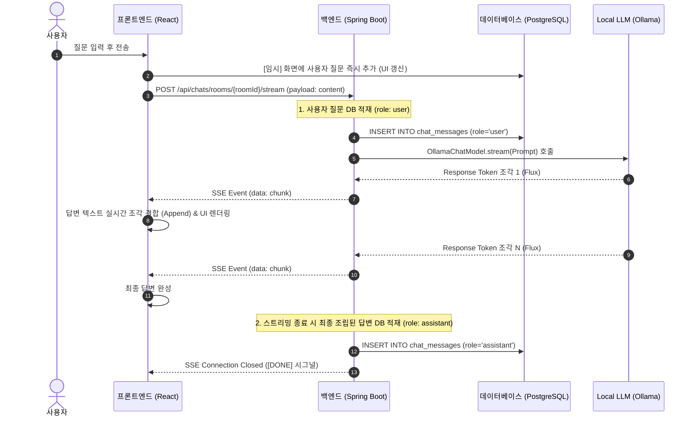

# KimsWeb AI 스트리밍 대화 흐름(Flow) 개통 계획서

이 계획서는 프론트엔드 대화창에서 질문을 던졌을 때, 백엔드(Spring Boot)가 이를 받아 Local LLM(Ollama Qwen2.5:14b)으로 전달하고, LLM의 응답 토큰들을 실시간 스트리밍(SSE) 방식으로 프론트엔드에 전달하여 대화 기록을 DB에 저장하는 전체 데이터 파이프라인의 설계 및 개통 계획서입니다.

---

## 🎯 목표 (Goal)
- **Local LLM 연동**: Spring AI의 `OllamaChatModel`을 활용해 로컬에서 구동 중인 Ollama `qwen2.5:14b` 모델과 백엔드 간 통신을 확보합니다.
- **실시간 SSE 스트리밍 개통**: 사용자 경험(UX) 극대화를 위해 단발성 응답 대신 `WebFlux` 및 `Flux<String>`을 활용한 **Server-Sent Events(SSE)** 스트리밍 API를 구축합니다.
- **대화 이력 자동 영속화**: 사용자의 질문(user)과 LLM의 최종 스트리밍 완성 답변(assistant)을 PostgreSQL 테이블(`kimsweb.chat_messages`)에 자동으로 적재합니다.

---

## 📐 AI 대화 스트리밍 시퀀스 흐름 (Sequence Flow)



---

## 🔒 사용자 검토 필요 사항 (User Review Required)
> [!IMPORTANT]
> - **Ollama 로컬 구동 여부**: 이 통신을 완벽하게 검증하기 위해서는 로컬 개발자 PC 또는 `jskn` 서버 상에서 Ollama가 구동 중이고 `qwen2.5:14b` 모델이 설치되어 있어야 합니다. (만약 로컬 Ollama가 아직 설치되어 있지 않거나 포트가 켜져 있지 않은 경우, 테스트 시 예외가 발생하므로 임시 Mock 스트리밍 모드 스위칭 코드를 백엔드에 안전장치로 구현하여 통신 흐름 개통 자체를 먼저 성사시킵니다.)
> - **SSE POST 통신**: 브라우저 표준 `EventSource`는 GET 요청만 지원하므로, 프론트엔드에서 POST 페이로드와 함께 스트림을 읽을 수 있도록 표준 `fetch` + `ReadableStream` 조합의 비동기 스트리밍 핸들러를 구축합니다.

---

## 🛠️ 제안된 변경 사항 (Proposed Changes)

### 1. 백엔드 스트리밍 컨트롤러 및 서비스 작성

#### [MODIFY] [ChatController.java](file:///home/kdy987/work/KimsWeb/backend/src/main/java/kr/co/kalpa/kimsweb/controller/ChatController.java)
* `/api/chats/rooms/{roomId}/stream` 엔드포인트를 추가하여 `MediaType.TEXT_EVENT_STREAM_VALUE` 스트림을 반환합니다.

#### [MODIFY] [ChatService.java](file:///home/kdy987/work/KimsWeb/backend/src/main/java/kr/co/kalpa/kimsweb/service/ChatService.java)
* `OllamaChatModel`을 주입받아 사용자의 질문을 저장하고, 비동기 스트림(`Flux`)을 반환하며 스트림 완료 시 AI 답변을 DB에 영속화합니다.

---

### 2. 프론트엔드 실시간 SSE 수신 훅 작성

#### [NEW] [useSSE.ts](file:///home/kdy987/work/KimsWeb/frontend/src/hooks/useSSE.ts)
* `fetch` API를 사용하여 POST 바디를 쏘고 리턴되는 `ReadableStream` 리더를 통해 한 바이트씩 텍스트 청크를 받아 화면에 누적 갱신하는 커스텀 훅을 구현합니다.

#### [MODIFY] [App.tsx](file:///home/kdy987/work/KimsWeb/frontend/src/App.tsx)
* 목업 `setTimeout` 응답을 걷어내고, 위 `useSSE` 훅을 호출하여 실시간 스트리밍 대화를 갱신하도록 비즈니스 연동을 구현합니다.

---

## 🧪 검증 계획 (Verification Plan)

### 수동 검증 (Manual Verification)
1. **백엔드/프론트엔드 빌드 및 기동**:
   ```bash
   bash bm.sh run
   bash fm.sh dev
   ```
2. **스트리밍 대화 테스트**:
   * 웹 브라우저(`http://localhost:3001`)에 접속하여 질문을 전송합니다.
   * AI의 글자가 실시간으로 타다다닥 조립되어 렌더링(타이핑 연출 효과)되는지 확인합니다.
3. **데이터베이스 영속성 체크**:
   * 대화가 완료된 후, 로컬 또는 jskn DB의 `kimsweb.chat_messages` 테이블을 조회하여 사용자의 질문과 AI의 조립된 최종 답변이 저장되었는지 쿼리로 검증합니다.
