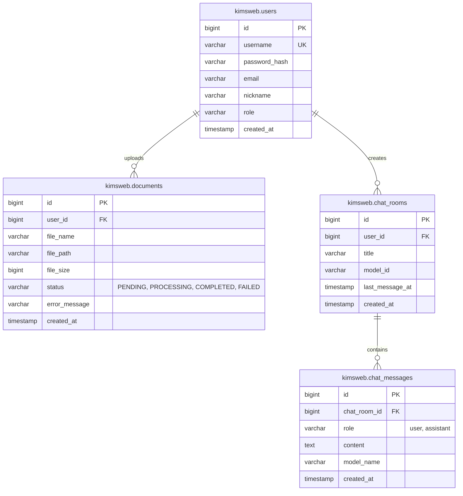

# KimsWeb PostgreSQL 테이블 스키마 설계 계획서 (완료)

이 계획서는 사용자 정보, RAG 문서 관리, AI 채팅 서비스 개발에 요구되는 관계형 데이터베이스(PostgreSQL 17.x)의 핵심 테이블 설계 및 `kimsweb` 스키마가 적용된 DDL 명세 구현에 대한 보고서입니다.

---

## 🎯 설계 목표 (Design Goal)
- **RAG 및 채팅 핵심 데이터 관리**: 사용자 인증, 대화 세션, RAG 문서 메타데이터의 영속성을 모델링합니다.
- **kimsweb 스키마 격리**: 다른 시스템 데이터와 격리될 수 있도록 모든 테이블 구조를 `kimsweb` 스키마 내에 안전하게 감쌉니다.
- **DDL 파일 분리**: 향후 이식과 운영 셋업이 편리하도록 DDL SQL 문을 단독 파일로 분리 보관합니다.

---

## 📐 데이터베이스 관계도 (ERD)

---

## 🛠️ DDL 파일 생성 완료

* 스키마 생성 및 kimsweb 전용 접두어가 부착된 DDL 문장이 [sqls/kimsweb_ddl.sql](file:///home/kdy987/work/KimsWeb/sqls/kimsweb_ddl.sql) 파일에 보관 및 작성되었습니다.

---

## 🧪 검증 및 구현 순서 (Next Steps)
1. **원격 DB 반영 (Jskn)**:
   * `jskn` Omen 서버의 PostgreSQL 데이터베이스 `kdy987_db`에 접속하여 생성된 `kimsweb_ddl.sql` 문장을 실행하여 4종의 테이블과 인덱스를 셋업합니다.
2. **JPA Entity 스키마 매핑**:
   * 백엔드 Entity 작성 시 `@Table(name = "users", schema = "kimsweb")` 형태로 스키마 설정을 연동하여 Spring Boot JPA가 테이블에 올바르게 액세스하도록 명세합니다.
