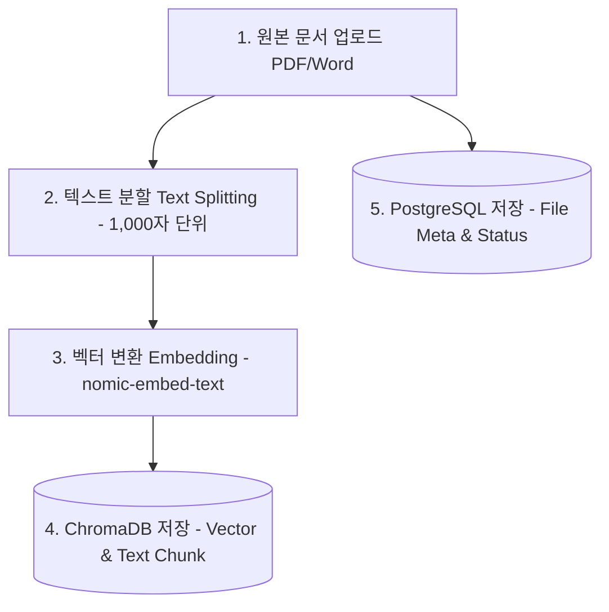
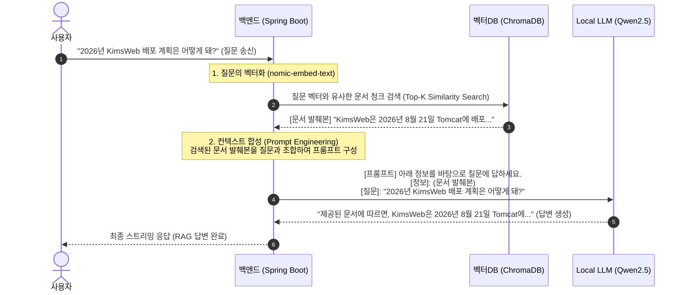

# KimsWeb RAG 및 ChromaDB 동작 구조 계획서

이 계획서는 RAG(Retrieval-Augmented Generation, 검색 증강 생성)와 벡터 데이터베이스인 ChromaDB가 시스템 상에서 **언제, 어떤 방식**으로 작동하는지 상세히 규정하고, 향후 RAG 연동 고도화 시점에 적용할 아키텍처 로직을 제안하는 문서입니다.

---

## 🎯 RAG와 ChromaDB의 역할 요약

* **RAG의 목적**: AI가 사전에 학습하지 않은 특정 문서(예: 사내 매뉴얼, 주식 보고서, 금융 계약서 등)에 기반하여 질문을 받았을 때, 문서 내용을 찾아내어 **"문서에 근거한 사실적 답변"**을 생성하게 만듭니다.
* **ChromaDB의 목적**: 텍스트 문장을 수치화한 **'벡터(Vector) 데이터'**를 저장하고, 사용자 질문 벡터와 가장 유사한 문서 구절을 초고속으로 계산하여 검색(Similarity Search)해주는 저장소입니다.

---

## 📐 RAG 전체 동작 시퀀스 (Ingestion & Retrieval)

RAG 아키텍처는 크게 **1) 문서 수집(Ingestion) 파이프라인**과 **2) 대화 검색(Retrieval & Generation) 파이프라인**의 2단계로 나누어 집니다.

### Phase 1. 문서 수집 및 인덱싱 단계 (Ingestion Pipeline)
> **[언제?]** 사용자가 새로운 가이드 문서(PDF, Word 등)를 업로드했을 때 실행됩니다.



* **어떻게?**:
  1. PDF 문서를 서버의 파일 시스템에 저장합니다.
  2. 문서를 사람이 읽을 수 있는 크기(예: 1,000자 단위)의 **청크(Chunk)**로 쪼갭니다.
  3. Spring AI `EmbeddingModel`을 사용해 각 청크를 768차원 등의 수치 벡터로 변환합니다.
  4. 변환된 벡터와 텍스트 원문을 **ChromaDB** 컬렉션에 적재합니다.
  5. PostgreSQL의 `documents` 테이블에 "변환 완료(COMPLETED)" 상태를 업데이트합니다.

---

### Phase 2. 대화 검색 및 답변 생성 단계 (Retrieval & Generation Flow)
> **[언제?]** 사용자가 대화창에서 질문을 전송하고, **LLM에 질문을 던지기 직전**에 백엔드 내부에서 동작합니다.



* **어떻게?**:
  1. 사용자가 질문("2026년 KimsWeb 배포 계획은 어떻게 돼?")을 보냅니다.
  2. 백엔드는 이 질문을 벡터로 임베딩합니다.
  3. **ChromaDB**에 질문 벡터를 던져 가장 유사한 상위 N개(예: Top-3)의 문서 청크를 가져옵니다.
  4. 가져온 문서 조각들을 프롬프트의 **컨텍스트(Context)** 구역에 주입합니다:
     > **[Prompt Template]**
     > You are a helpful financial AI assistant. Use the following context to answer the question at the end.
     > 
     > **[Context]**  
     > (ChromaDB에서 찾아온 문서 구절 1)  
     > (ChromaDB에서 찾아온 문서 구절 2)  
     > 
     > **[Question]**  
     > 2026년 KimsWeb 배포 계획은 어떻게 돼?
  5. 조립된 프롬프트를 로컬 LLM(`qwen2.5:14b`)으로 전달하여 스트리밍 답변을 시작합니다.

---

## 🛠️ 향후 구현 로직 제안 (Spring AI 연동)

실제 RAG 기능을 개발할 때는 Spring AI의 `VectorStore`와 `ChatClient`가 지원하는 **`QuestionAnswerAdvisor`** 또는 **`VectorStoreChatMemory`**를 사용해 아래 한 줄만으로 이 검색 흐름을 완전히 자동화할 수 있습니다.

```java
// Spring AI를 이용한 자동 RAG 설정 예시 (서비스단 적용 예정)
var chatClient = ChatClient.builder(chatModel)
        .defaultAdvisors(new QuestionAnswerAdvisor(vectorStore, SearchRequest.defaults()))
        .build();

// 호출 시 자동으로 질문 임베딩 -> ChromaDB 조회 -> 컨텍스트 조립 -> LLM 호출을 처리
Flux<String> response = chatClient.prompt()
        .user(userQuestion)
        .stream()
        .content();
```

---

## 🔒 검증 및 연동 로드맵 (Roadmap)
- **1단계**: 로컬 LLM과의 단순 스트리밍 통신 흐름 개통 (현재 승인 대기 중인 단계)
- **2단계**: 프론트엔드 PDF 업로드 API 구현 및 파일 시스템 적재
- **3단계**: 백엔드에서 PDF 문서 텍스트 추출 및 ChromaDB 임베딩 인덱싱 파이프라인 개발
- **4단계**: 챗 API 호출 시 ChromaDB 검색(Retrieval) 조언자(Advisor)를 탑재하여 최종 금융/주식 RAG 시스템 완성
