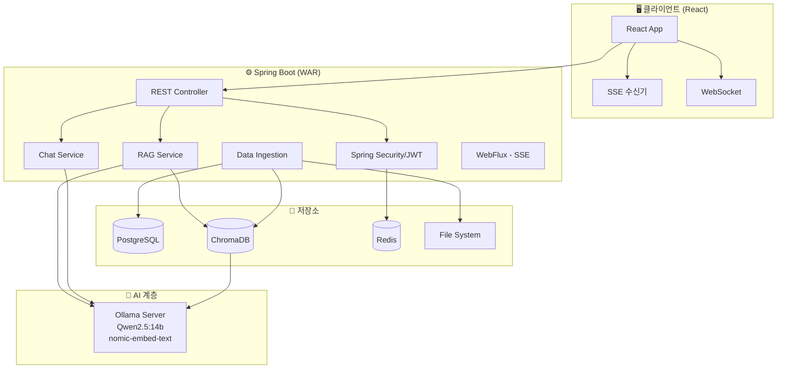

## 🏠 KimsWeb - 최종 기술스택

### 🎯 핵심 아키텍처 원칙
> **Spring Boot 기반의 모놀리식 + RAG 서비스**, 가족/개인용 로컬 지식 작업실

---

## 🎨 Frontend

| 구분 | 기술 | 버전 | 라이센스 | 역할 |
|------|------|------|----------|------|
| 1 | **React** | 19.2.x | MIT | UI 컴포넌트 라이브러리. 가족용 인터페이스 구현 |
| 2 | **Vite** | 6.x | MIT | 빠른 빌드 도구 및 개발 서버. HMR, 프록시 설정 |
| 3 | **TypeScript** | 5.7.x | Apache-2.0 | 정적 타입 시스템. 안전한 상태 관리 |
| 4 | **Tailwind CSS** | 4.1.x | MIT | 유틸리티 기반 CSS. 빠른 UI 스타일링 |
| 5 | **shadcn/ui** | latest | MIT | Radix UI 기반 컴포넌트. 일관된 디자인 시스템 |
| 6 | **AG Grid Community** | 34.3.x | MIT | 고성능 데이터 그리드. 주식/계좌 데이터 표시 |
| 7 | **Zustand** | 5.x | MIT | 전역 상태 관리. 채팅/문서 업로드 상태 관리 |
| 8 | **React Hook Form** | 7.x | MIT | 폼 상태 관리. 문서 업로드/설정 폼 |
| 9 | **Zod** | 3.x | MIT | 스키마 기반 유효성 검증. API 응답/폼 검증 |
| 10 | **axios** | 1.7.x | MIT | HTTP 클라이언트. 인터셉터, JWT 처리 |
| 11 | **TanStack Query** | 5.x | MIT | 서버 상태 관리. API 캐싱, 리페치 |
| 12 | **EventSource (SSE)** | 내장 | - | Server-Sent Events. LLM 스트리밍 응답 수신 |
| 13 | **React Markdown** | 9.x | MIT | Markdown 렌더링. LLM 응답 표시 |

---

## ⚙️ Backend

| 구분 | 기술 | 버전 | 라이센스 | 역할 |
|------|------|------|----------|------|
| **Build** | **Gradle** | 8.x | Apache-2.0 | 빌드 도구. 의존성 관리 |
| **Language** | **Java** | 21 (LTS) | Oracle/GPLv2 | 서버 사이드 언어. 안정성/성능 |
| **Framework** | **Spring Boot** | 3.4.x | Apache-2.0 | 백엔드 프레임워크. REST API, DI, 자동 설정 |
| **Security** | **Spring Security** | 6.4.x | Apache-2.0 | 인증/인가. JWT 기반 접근 제어 |
| **DB** | **PostgreSQL** | 17.x | PostgreSQL | 관계형 DB. 계좌/주식/문서 메타데이터 저장 |
| **Cache** | **Redis** | 7.4.x | RSALv2/SSPLv1 | 인메모리 캐시. 세션 관리, API 캐싱 |
| **Vector DB** | **ChromaDB** | latest | Apache-2.0 | 벡터 DB. 문서 임베딩 저장/검색 (Docker 컨테이너) |
| **AI** | **Spring AI** | 1.0.x | Apache-2.0 | AI 통합 추상화. Ollama/ChromaDB 연동 |
| **LLM** | **Ollama (Qwen2.5:14b)** | latest | MIT | 로컬 LLM 서버. 대화 생성/임베딩 |
| **임베딩** | **nomic-embed-text** | latest | Apache-2.0 | 텍스트 임베딩 모델. 문서/질문 벡터화 |
| **HTTP** | **Spring WebFlux** | 내장 | Apache-2.0 | 비동기/논블로킹 HTTP. SSE 스트리밍 지원 |
| **ORM** | **Spring Data JPA** | 3.4.x | Apache-2.0 | JPA 기반 ORM. DB 연동 추상화 |
| **SQL Mapper** | **MyBatis** | 3.5.x | Apache-2.0 | (기존 자산 활용) 복잡한 금융 쿼리 처리 |
| **Auth** | **JWT (jjwt)** | 0.12.x | Apache-2.0 | JWT 토큰 인증. Access/Refresh Token |
| **Real-time** | **WebSocket (STOMP)** | 내장 | Apache-2.0 | 실시간 시세/알림 (선택적) |
| **Batch** | **Spring Batch** | 5.1.x | Apache-2.0 | 정기적 문서/주식 데이터 수집 작업 |

---

## 🗄️ 데이터 저장소 구성

| 저장소 | 용도 | 데이터 예시 |
| :--- | :--- | :--- |
| **PostgreSQL** | 관계형/메타데이터 | 사용자 정보, 계좌 정보, 문서 메타데이터, 대화 히스토리 |
| **ChromaDB** | 벡터 데이터 | 문서 청크 임베딩, 질문 임베딩 (RAG 검색용) |
| **Redis** | 캐시/세션 | JWT 토큰, API 응답 캐시, 임시 데이터 |
| **File System** | 파일 저장 | 업로드된 PDF/워드/스크립트 파일 원본 |

---

## 🏗️ 전체 아키텍처 다이어그램



---

## 🐳 Docker 배포 구성 (추가)

```yaml
services:
  # Tomcat + Spring Boot WAR
  kimsweb-app:
    image: tomcat:11-jre21
    container_name: kimsweb-app
    ports:
      - "8080:8080"
    volumes:
      - ./kimsweb.war:/usr/local/tomcat/webapps/ROOT.war
      - ./data:/data/kimsweb
    depends_on:
      - postgres
      - chromadb
      - redis
    networks:
      - kimsweb-network

  # PostgreSQL (메타데이터 + pgvector)
  postgres:
    image: pgvector/pgvector:pg17
    container_name: kimsweb-postgres
    ports:
      - "5432:5432"
    environment:
      POSTGRES_DB: kimsweb
      POSTGRES_USER: kimsweb
      POSTGRES_PASSWORD: ${DB_PASSWORD}
    volumes:
      - ./postgres-data:/var/lib/postgresql/data
    networks:
      - kimsweb-network

  # ChromaDB (벡터 DB)
  chromadb:
    image: chromadb/chroma:latest
    container_name: kimsweb-chroma
    ports:
      - "8000:8000"
    volumes:
      - ./chroma-data:/chroma/chroma
    environment:
      - IS_PERSISTENT=TRUE
      - ANONYMIZED_TELEMETRY=FALSE
    networks:
      - kimsweb-network

  # Redis (캐시/세션)
  redis:
    image: redis:7-alpine
    container_name: kimsweb-redis
    ports:
      - "6379:6379"
    volumes:
      - ./redis-data:/data
    networks:
      - kimsweb-network
```

---

## 📦 주요 의존성 (build.gradle)

```gradle
dependencies {
    // Spring Boot
    implementation 'org.springframework.boot:spring-boot-starter-web'
    implementation 'org.springframework.boot:spring-boot-starter-webflux'
    implementation 'org.springframework.boot:spring-boot-starter-security'
    implementation 'org.springframework.boot:spring-boot-starter-data-jpa'
    implementation 'org.springframework.boot:spring-boot-starter-data-redis'
    implementation 'org.springframework.boot:spring-boot-starter-websocket'
    
    // Spring AI
    implementation 'org.springframework.ai:spring-ai-ollama-spring-boot-starter'
    implementation 'org.springframework.ai:spring-ai-pgvector-store-spring-boot-starter'
    implementation 'org.springframework.ai:spring-ai-chroma-store-spring-boot-starter'
    
    // Database
    implementation 'org.postgresql:postgresql'
    implementation 'org.mybatis.spring.boot:mybatis-spring-boot-starter:3.0.x'
    
    // Auth
    implementation 'io.jsonwebtoken:jjwt-api:0.12.x'
    runtimeOnly 'io.jsonwebtoken:jjwt-impl:0.12.x'
    runtimeOnly 'io.jsonwebtoken:jjwt-jackson:0.12.x'
    
    // Utils
    implementation 'org.apache.commons:commons-lang3'
    implementation 'commons-io:commons-io:2.x'
    
    // Lombok
    compileOnly 'org.projectlombok:lombok'
    annotationProcessor 'org.projectlombok:lombok'
}
```

---

## 💡 기술 선택 이유 요약

| 선택 | 이유 |
| :--- | :--- |
| **Spring Boot 3.4 + Java 21** | LTS 버전으로 안정성, Virtual Thread 지원 |
| **Spring WebFlux** | SSE 스트리밍 응답을 비동기로 효율적 처리 |
| **Spring AI** | Ollama/ChromaDB 연동을 표준화된 방식으로 추상화 |
| **ChromaDB** | 가볍고 Docker 배포 쉬움, Spring AI 공식 지원 |
| **pgvector (병행)** | PostgreSQL에 벡터 기능 추가, 기존 DB 통합 |
| **React + shadcn/ui** | 빠른 UI 개발, 일관된 디자인 |
| **TanStack Query** | 서버 상태 관리 최적화, 캐싱 |

---

이제 이 기술스택을 기반으로 **KimsWeb** 개발을 시작하시면 됩니다! 😊